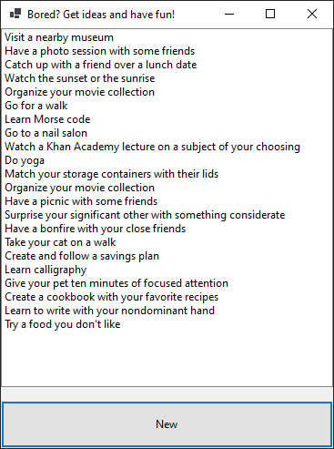

# GetActivityIdeas
 A WinForm app in C# that fetches activity ideas from the Bored API and displays them in a ListBox. Created as a simple program to practice async programming in C#.

 ## Screenshot

 
